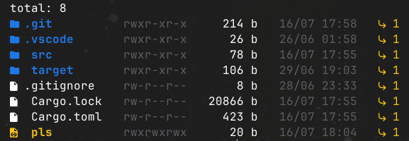
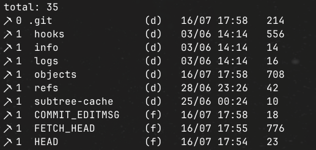

# pls




`pls` is a filesystem utility aimed to replace the default `ls` command by making it more modern and configurable.

## Usage

`pls` has 2 different usages: (more coming!)

- `pls <path> [options]`: lists the `<path>` directory like ls.
- `pls find <name> [path]`: searches in `[path]` for the file with name `<name>`. Very fast!!

## Installation

Just clone the repo:

```sh
git clone https://github.com/saverioscagnoli/pls.git
```

Build it with cargo:

```
cd pls && cargo build --release
```

Then, put the executable in `$PATH`. Example for linux:

```
sudo cp ./target/release/pls /usr/bin
```

## Configuration

`pls` can be configured with a `json` file. The file MUST be placed under the user's config folder. Example on linux: `~/.config/pls/config.json`

The file MUST be named `config.json`. If not found or present, it will use a default configuration, even if the config is not fully set, it will fill the empty slots with the default ones.

Example configuration:

```json
{
  "ls": {
    "padding": 4,
    "headers": [
        "Name",
        "Number of Links^", // -> ^ makes it center-aligned
        "Permissions"
    ]
    "templates": [
      "{name} {[type](directory:d)(file:f)(symlink:l)(executable:x)}",
      "{nlink}",
      "{permissions}"
      // ...
    ],
    "time_format": "%d/%m"
  }
}
```

## License

MIT
